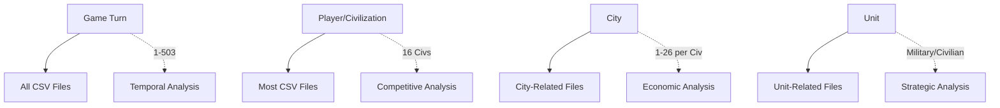

# 🔗 Civ VI CSV Relational Mapping & ML Analysis Framework

**Generated:** August 3, 2025  
**Purpose:** Complete relational diagram and ML analysis strategy for 45 Civ VI CSV files  
**Objective:** Answer game questions through connected data analysis

---

## 🎯 **Core Relational Keys & Connections**

### **Primary Keys (Universal Identifiers)**


### **Relationship Matrix**

| File Category | Primary Key | Secondary Key | Foreign Keys | ML Purpose |
|--------------|-------------|---------------|--------------|------------|
| **Player Stats** | Game Turn + Player | - | - | Victory Prediction |
| **AI Behavior** | Game Turn + Player | AI Action | Player Stats | Decision Analysis |
| **City Management** | Game Turn + Player + City | Building/District | Player Stats | Economic Modeling |
| **Military & Combat** | Game Turn + Player | Unit/Combat | Player Stats | Military Analysis |
| **Diplomacy** | Game Turn + Player | Target Player | Player Stats | Relationship Modeling |
| **Religion & Culture** | Game Turn + Player | Religion/Tourism | Player Stats | Soft Power Analysis |

---

## 📊 **Complete Data Schema & Relationships**

### **Tier 1: Core Game State (Master Tables)**

#### 🏆 **Player_Stats.csv** - Master Player Data
```sql
-- Primary table for all player analysis
player_stats (
    game_turn INTEGER,           -- Universal time key
    player_name VARCHAR(50),     -- Universal player key  
    num_cities INTEGER,          -- Links to City data
    population INTEGER,          -- Economic indicator
    techs INTEGER,               -- Science progress
    civics INTEGER,              -- Culture progress
    yield_science INTEGER,       -- Victory condition tracking
    yield_culture INTEGER,       -- Victory condition tracking
    total_score INTEGER          -- Overall progress metric
) PRIMARY KEY (game_turn, player_name)
```

#### 🏆 **Game_PlayerScores.csv** - Detailed Scoring
```sql
-- Detailed score breakdown by category
game_player_scores (
    game_turn INTEGER,
    player_id INTEGER,           -- Maps to player_name
    total_score INTEGER,
    score_civics INTEGER,        -- Culture victory component
    score_tech INTEGER,          -- Science victory component
    score_empire INTEGER,        -- Domination victory component
    score_religion INTEGER      -- Religious victory component
) PRIMARY KEY (game_turn, player_id)
```

---

### **Tier 2: Specialized Domain Tables**

#### 🏙️ **City & Economic Data**
```sql
-- AI_CityBuild.csv
city_build_decisions (
    game_turn INTEGER REFERENCES player_stats(game_turn),
    player_name VARCHAR(50) REFERENCES player_stats(player_name),
    city_name VARCHAR(100),
    food_advantage DECIMAL,
    production_advantage DECIMAL,
    construction_type VARCHAR(100),
    decision_source VARCHAR(50)
) 

-- City_BuildQueue.csv  
city_build_queue (
    game_turn INTEGER,
    player_name VARCHAR(50),
    city_name VARCHAR(100),
    queue_position INTEGER,
    item_type VARCHAR(100),
    turns_remaining INTEGER
)
```

#### ⚔️ **Military & Combat Data**
```sql
-- CombatLog.csv
combat_events (
    game_turn INTEGER REFERENCES player_stats(game_turn),
    attacker_player VARCHAR(50),
    defender_player VARCHAR(50),
    unit_type VARCHAR(100),
    combat_result VARCHAR(50),
    damage_dealt INTEGER,
    experience_gained INTEGER
)

-- AI_Military.csv
military_decisions (
    game_turn INTEGER,
    player_name VARCHAR(50),
    military_strategy VARCHAR(100),
    unit_production_priority VARCHAR(100),
    threat_assessment DECIMAL
)
```

#### 🤝 **Diplomacy & Relations**
```sql
-- DiplomacyManager.csv
diplomacy_state (
    game_turn INTEGER,
    player_a VARCHAR(50),
    player_b VARCHAR(50),
    relationship_type VARCHAR(50),
    trust_level DECIMAL,
    trade_agreement BOOLEAN
)

-- DiplomacyModifiers.csv
diplomacy_modifiers (
    game_turn INTEGER,
    player_a VARCHAR(50),
    player_b VARCHAR(50),
    modifier_type VARCHAR(100),
    modifier_value DECIMAL,
    source_event VARCHAR(100)
)
```

#### 🎭 **Culture & Religion**
```sql
-- Cultural_Identity.csv
cultural_influence (
    game_turn INTEGER,
    source_player VARCHAR(50),
    target_player VARCHAR(50),
    culture_pressure DECIMAL,
    tourism_influence DECIMAL,
    dominant_culture VARCHAR(50)
)

-- Game_Religion.csv
religious_state (
    game_turn INTEGER,
    player_name VARCHAR(50),
    religion_name VARCHAR(100),
    follower_count INTEGER,
    holy_city VARCHAR(100),
    faith_generation DECIMAL
)
```

---

## 🔍 **Key Relationship Patterns**

### **1. Temporal Progression Analysis**
```python
# Track player progression over time
def analyze_player_progression(player_name):
    query = """
    SELECT 
        ps.game_turn,
        ps.yield_science,
        ps.yield_culture,
        ps.num_cities,
        gs.total_score,
        COUNT(cb.city_name) as cities_building,
        AVG(dm.trust_level) as avg_diplomacy
    FROM player_stats ps
    LEFT JOIN game_player_scores gs ON ps.game_turn = gs.game_turn 
    LEFT JOIN city_build_decisions cb ON ps.game_turn = cb.game_turn AND ps.player_name = cb.player_name
    LEFT JOIN diplomacy_state dm ON ps.game_turn = dm.game_turn AND ps.player_name = dm.player_a
    WHERE ps.player_name = %s
    ORDER BY ps.game_turn
    """
    return execute_query(query, [player_name])
```

### **2. Competitive Analysis Framework**
```python
# Compare players at specific game phases
def competitive_snapshot(turn_number):
    query = """
    SELECT 
        ps.player_name,
        ps.yield_science,
        ps.yield_culture,
        ps.num_cities,
        ps.population,
        COUNT(ce.combat_result) as battles_won,
        AVG(ci.tourism_influence) as cultural_influence,
        COUNT(rs.religion_name) as religions_founded
    FROM player_stats ps
    LEFT JOIN combat_events ce ON ps.game_turn = ce.game_turn AND ps.player_name = ce.attacker_player AND ce.combat_result = 'Victory'
    LEFT JOIN cultural_influence ci ON ps.game_turn = ci.game_turn AND ps.player_name = ci.source_player
    LEFT JOIN religious_state rs ON ps.game_turn = rs.game_turn AND ps.player_name = rs.player_name
    WHERE ps.game_turn = %s
    GROUP BY ps.player_name
    ORDER BY ps.total_score DESC
    """
    return execute_query(query, [turn_number])
```

---

## 🤖 **ML Analysis Questions & Data Sources**

### **Victory Prediction Models**

#### 🔬 **Science Victory Prediction**
```python
# Data sources and features
SCIENCE_FEATURES = {
    'primary': ['yield_science', 'techs', 'score_tech'],           # Player_Stats + Game_PlayerScores
    'secondary': ['research_focus', 'campus_count'],               # AI_Research + City data
    'competitive': ['science_rank', 'tech_advantage'],             # Derived from all players
    'temporal': ['science_growth_rate', 'tech_acquisition_rate']   # Time-series analysis
}

# Key question: "Which player will achieve Science Victory and when?"
def predict_science_victory():
    features = """
    SELECT 
        ps.game_turn,
        ps.player_name,
        ps.yield_science,
        ps.techs,
        gs.score_tech,
        ar.research_priority,
        COUNT(cb.construction_type) FILTER (WHERE cb.construction_type LIKE '%CAMPUS%') as campus_count,
        RANK() OVER (PARTITION BY ps.game_turn ORDER BY ps.yield_science DESC) as science_rank
    FROM player_stats ps
    JOIN game_player_scores gs ON ps.game_turn = gs.game_turn AND ps.player_name = gs.player_name
    LEFT JOIN ai_research ar ON ps.game_turn = ar.game_turn AND ps.player_name = ar.player_name
    LEFT JOIN city_build_decisions cb ON ps.game_turn = cb.game_turn AND ps.player_name = cb.player_name
    """
```

#### 🎨 **Culture Victory Prediction**
```python
CULTURE_FEATURES = {
    'primary': ['yield_culture', 'tourism', 'civics'],            # Player_Stats
    'influence': ['cultural_pressure', 'tourism_influence'],      # Cultural_Identity
    'competitive': ['culture_rank', 'tourism_dominance'],         # Derived metrics
    'infrastructure': ['theater_count', 'wonder_count']           # City_BuildQueue analysis
}

# Key question: "Who will achieve cultural dominance?"
def predict_culture_victory():
    features = """
    SELECT 
        ps.game_turn,
        ps.player_name,
        ps.yield_culture,
        ps.tourism,
        SUM(ci.tourism_influence) as total_influence,
        COUNT(ci.target_player) as players_influenced,
        RANK() OVER (PARTITION BY ps.game_turn ORDER BY ps.tourism DESC) as tourism_rank
    FROM player_stats ps
    LEFT JOIN cultural_influence ci ON ps.game_turn = ci.game_turn AND ps.player_name = ci.source_player
    GROUP BY ps.game_turn, ps.player_name, ps.yield_culture, ps.tourism
    """
```

#### ⚔️ **Domination Victory Prediction**
```python
DOMINATION_FEATURES = {
    'military': ['land_units', 'naval_units', 'corps', 'armies'], # Player_Stats
    'combat': ['battles_won', 'damage_dealt', 'units_killed'],    # CombatLog
    'territory': ['num_cities', 'tiles_owned', 'capitals_taken'], # Player_Stats + derived
    'strategy': ['military_focus', 'aggression_level']            # AI_Military
}

# Key question: "Who will conquer the world?"
def predict_domination_victory():
    features = """
    SELECT 
        ps.game_turn,
        ps.player_name,
        ps.land_units + ps.naval_units as total_military,
        ps.num_cities,
        COUNT(ce.combat_result) FILTER (WHERE ce.combat_result = 'Victory') as battles_won,
        SUM(ce.damage_dealt) as total_damage,
        am.aggression_score
    FROM player_stats ps
    LEFT JOIN combat_events ce ON ps.game_turn = ce.game_turn AND ps.player_name = ce.attacker_player
    LEFT JOIN ai_military am ON ps.game_turn = am.game_turn AND ps.player_name = am.player_name
    GROUP BY ps.game_turn, ps.player_name, ps.land_units, ps.naval_units, ps.num_cities, am.aggression_score
    """
```

#### 🕊️ **Diplomatic Victory Prediction**
```python
DIPLOMATIC_FEATURES = {
    'victory_points': ['diplo_victory_points', 'favor_balance'],   # Player_Stats_2
    'relationships': ['positive_relations', 'trade_partners'],     # DiplomacyManager
    'influence': ['emergency_participation', 'resolution_votes'], # World_Congress
    'resources': ['diplomatic_favor', 'gold_reserves']            # Player_Stats
}

# Key question: "Who will unite the world diplomatically?"
def predict_diplomatic_victory():
    features = """
    SELECT 
        ps.game_turn,
        ps.player_name,
        ps2.diplo_victory_points,
        ps2.balance_favor,
        COUNT(dm.relationship_type) FILTER (WHERE dm.relationship_type = 'Allied') as allies,
        AVG(dm.trust_level) as avg_trust,
        wc.favor_spent_on_resolutions
    FROM player_stats ps
    JOIN player_stats_2 ps2 ON ps.game_turn = ps2.game_turn AND ps.player_name = ps2.player_name
    LEFT JOIN diplomacy_state dm ON ps.game_turn = dm.game_turn AND ps.player_name = dm.player_a
    LEFT JOIN world_congress wc ON ps.game_turn = wc.game_turn AND ps.player_name = wc.player_name
    GROUP BY ps.game_turn, ps.player_name, ps2.diplo_victory_points, ps2.balance_favor, wc.favor_spent_on_resolutions
    """
```

---

## 🎮 **Advanced Game Analysis Questions**

### **Strategic Decision Analysis**
```python
# Question: "What factors lead to successful city placement?"
def analyze_city_success():
    return """
    SELECT 
        cb.player_name,
        cb.city_name,
        cb.food_advantage,
        cb.production_advantage,
        ps.population,
        ps.yield_science + ps.yield_culture + ps.yield_production as total_yields,
        CASE 
            WHEN ps.population > AVG(ps.population) OVER () THEN 'High Growth'
            ELSE 'Low Growth'
        END as growth_category
    FROM city_build_decisions cb
    JOIN player_stats ps ON cb.game_turn = ps.game_turn AND cb.player_name = ps.player_name
    WHERE cb.city_name IS NOT NULL
    """

# Question: "Which diplomatic strategies are most effective?"
def analyze_diplomatic_strategies():
    return """
    SELECT 
        dm.player_a as player,
        dm.relationship_type,
        AVG(dmod.modifier_value) as avg_modifier,
        COUNT(*) as relationship_count,
        CORR(ps.total_score, dm.trust_level) as score_trust_correlation
    FROM diplomacy_state dm
    JOIN diplomacy_modifiers dmod ON dm.game_turn = dmod.game_turn AND dm.player_a = dmod.player_a
    JOIN player_stats ps ON dm.game_turn = ps.game_turn AND dm.player_a = ps.player_name
    GROUP BY dm.player_a, dm.relationship_type
    """

# Question: "What military strategies lead to victory?"
def analyze_military_effectiveness():
    return """
    SELECT 
        ce.attacker_player,
        ce.unit_type,
        COUNT(*) as total_battles,
        COUNT(*) FILTER (WHERE ce.combat_result = 'Victory') as victories,
        AVG(ce.damage_dealt) as avg_damage,
        (COUNT(*) FILTER (WHERE ce.combat_result = 'Victory')::FLOAT / COUNT(*)) as win_rate
    FROM combat_events ce
    GROUP BY ce.attacker_player, ce.unit_type
    HAVING COUNT(*) >= 5
    ORDER BY win_rate DESC
    """
```

### **Economic Analysis**
```python
# Question: "Which economic strategies drive growth?"
def analyze_economic_patterns():
    return """
    SELECT 
        ps.player_name,
        ps.game_turn,
        ps.yield_gold,
        ps.yield_production,
        ps2.buildings,
        ps2.outgoing_trade_routes,
        LAG(ps.yield_gold, 10) OVER (PARTITION BY ps.player_name ORDER BY ps.game_turn) as gold_10_turns_ago,
        ps.yield_gold - LAG(ps.yield_gold, 10) OVER (PARTITION BY ps.player_name ORDER BY ps.game_turn) as gold_growth
    FROM player_stats ps
    JOIN player_stats_2 ps2 ON ps.game_turn = ps2.game_turn AND ps.player_name = ps2.player_name
    WHERE ps.game_turn % 10 = 0  -- Sample every 10 turns
    """
```

---

## 🔗 **Data Integration Pipeline**

### **Step 1: Data Loading & Cleaning**
```python
class CivDataIntegrator:
    def __init__(self):
        self.tables = {
            'core': ['player_stats', 'game_player_scores', 'player_stats_2'],
            'ai': ['ai_citybuild', 'ai_military', 'ai_research', 'ai_diplomacy'],
            'events': ['combat_log', 'cultural_identity', 'diplomacy_manager'],
            'systems': ['game_religion', 'world_congress', 'game_greatpeople']
        }
    
    def create_unified_view(self):
        """Create master view combining all data sources"""
        return """
        CREATE VIEW unified_game_state AS
        SELECT 
            ps.game_turn,
            ps.player_name,
            -- Core metrics
            ps.yield_science, ps.yield_culture, ps.num_cities, ps.population,
            -- Extended metrics  
            ps2.tourism, ps2.diplo_victory_points, ps2.buildings,
            -- Scoring
            gs.total_score, gs.score_tech, gs.score_civics,
            -- Military
            ps.land_units + ps.naval_units as total_military,
            -- Derived features
            RANK() OVER (PARTITION BY ps.game_turn ORDER BY ps.yield_science DESC) as science_rank,
            RANK() OVER (PARTITION BY ps.game_turn ORDER BY ps.yield_culture DESC) as culture_rank,
            RANK() OVER (PARTITION BY ps.game_turn ORDER BY gs.total_score DESC) as score_rank
        FROM player_stats ps
        JOIN player_stats_2 ps2 ON ps.game_turn = ps2.game_turn AND ps.player_name = ps2.player_name
        JOIN game_player_scores gs ON ps.game_turn = gs.game_turn AND ps.player_name = gs.player_name
        """
```

### **Step 2: Feature Engineering**
```python
def create_ml_features():
    """Generate advanced features for ML models"""
    return """
    SELECT 
        *,
        -- Time-based features
        game_turn / 503.0 as game_progress,
        CASE 
            WHEN game_turn <= 167 THEN 'Early'
            WHEN game_turn <= 335 THEN 'Mid'  
            ELSE 'Late'
        END as game_phase,
        
        -- Growth rates (10-turn windows)
        yield_science - LAG(yield_science, 10) OVER player_window as science_growth,
        yield_culture - LAG(yield_culture, 10) OVER player_window as culture_growth,
        
        -- Competitive features
        yield_science / AVG(yield_science) OVER turn_window as science_vs_avg,
        total_score / MAX(total_score) OVER turn_window as score_vs_leader,
        
        -- Victory condition proximity
        CASE WHEN science_rank = 1 AND yield_science > 100 THEN 1 ELSE 0 END as science_leader,
        CASE WHEN culture_rank = 1 AND tourism > 50 THEN 1 ELSE 0 END as culture_leader
        
    FROM unified_game_state
    WINDOW 
        player_window AS (PARTITION BY player_name ORDER BY game_turn),
        turn_window AS (PARTITION BY game_turn)
    """
```

---

## 🎯 **Implementation Roadmap**

### **Phase 1: Core Integration (Week 1)**
1. ✅ Load and clean primary tables (Player_Stats, Game_PlayerScores)
2. 🔄 Process secondary tables (AI behavior, City data)
3. 🔄 Create unified schema with foreign key relationships
4. 🔄 Build basic relational queries

### **Phase 2: Advanced Analysis (Week 2)**
1. 🔄 Implement victory prediction models
2. 🔄 Create strategic decision analysis queries
3. 🔄 Build competitive analysis dashboard
4. 🔄 Develop temporal progression tracking

### **Phase 3: ML Pipeline (Week 3)**
1. 🔄 Feature engineering pipeline
2. 🔄 Model training and validation
3. 🔄 Real-time prediction API
4. 🔄 Automated game analysis reports

---

## 🎮 **Ultimate Goal: Game Intelligence System**

This relational framework enables us to answer complex questions like:

- **"At turn 200, which player is most likely to win and by what victory type?"**
- **"What early game decisions correlate with late game success?"**
- **"How do diplomatic relationships affect military outcomes?"**
- **"Which civilizations have the strongest economic engines?"**
- **"What cultural strategies overcome military disadvantages?"**

By connecting all 45 CSV files through these relationships, we create a comprehensive game intelligence system that can provide insights into Civilization VI strategy, balance, and optimal play patterns! 🚀
